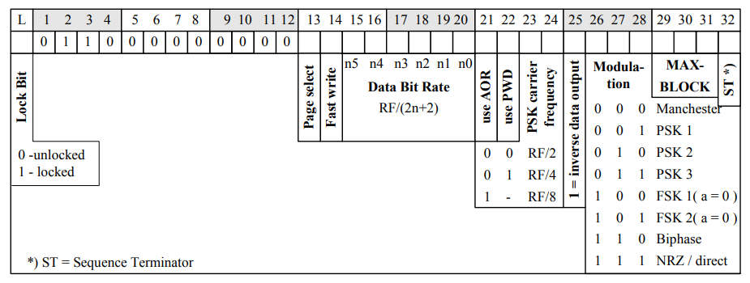

# lf t55xx Command User Guide <a name="top"></a>
Ver. 0.1 - Oct 2019 

## Contents 

### Commands  
  
[lf t55xx bruteforce](#bruteforce)  
[lf t55xx config](#config)  
[lf t55xx chk](#chk)  
[lf t55xx dangerraw](#dangerraw)  
[lf t55xx detect](#detect)  
[lf t55xx deviceconfig](#deviceconfig)  
[lf t55xx dump](#dump)  
[lf t55xx restore](#restore)  
[lf t55xx info](#info)  
[lf t55xx p1detect](#p1detect)  
[lf t55xx protect](#protect)  
[lf t55xx read](#read)  
[lf t55xx resetread](#resetread)  
[lf t55xx recoverpw](#recoverpw)  
[lf t55xx special](#special)  
[lf t55xx trace](#trace)  
[lf t55xx wakeup](#wakeup)  
[lf t55xx wipe](#wipe)  
[lf t55xx write](#write)  

### Chip Configuration
[T5555 (Q5)](#T5555) | [T5557](#T5557) | [T5577](#T5577) 

### Links/References
 

---

## lf t55xx bruteforce <a name="bruteforce"></a>
[back to top](#top)  

### Description
```
  This command uses bruteforce to scan a number range
  press 'enter'  to cancel the command
  WARNING:  this may brick non-password protected chips!
  Try reading block 7 before
```
### Options
```
  Usage: lf t55xx bruteforce [h] [r <mode>] [s <start password>] [e <end password>]
         password must be 4 bytes (8 hex symbols)
  Options:
       h            - this help
       r <mode>     - downlink encoding 0|1|2|3|4
                         0 - fixed bit length
                         1 - long leading reference
                         2 - leading zero
                         3 - 1 of 4 coding reference
                         4 - Try all downlink modes (default)
       s <start_pwd>  - 4 byte hex value to start pwd search at
       e <end_pwd>    - 4 byte hex value to end pwd search at
  
  Examples:
         lf t55xx bruteforce r 2 s aaaaaa77 e aaaaaa99
```
### Example

---
## lf t55xx config <a name="config"></a>
[back to top](#top)  

### Description

### Options

### Example

---
## lf t55xx chk <a name="chk"></a>
[back to top](#top)  

### Description

### Options

### Example

---
## lf t55xx dangerraw <a name="dangerraw"></a>
[back to top](#top)  

### Description

### Options

### Example

---
## lf t55xx detect <a name="detect"></a>
[back to top](#top)  

### Description

### Options

### Example

---
## lf t55xx deviceconfig <a name="deviceconfig"></a>
[back to top](#top)  

### Description

### Options

### Example

---
## lf t55xx dump <a name="dump"></a>
[back to top](#top)  

### Description

### Options

### Example

---
## lf t55xx restore <a name="restore"></a>
[back to top](#top)  

### Description

### Options

### Example

---
## lf t55xx info <a name="info"></a>
[back to top](#top)  

### Description

### Options

### Example

---
## lf t55xx p1detect <a name="p1detect"></a>
[back to top](#top)  

### Description

### Options

### Example

---
## lf t55xx protect <a name="protect"></a>
[back to top](#top)  

### Description

### Options

### Example

---
## lf t55xx read <a name="read"></a>
[back to top](#top)  

### Description

### Options

### Example

---
## lf t55xx resetread <a name="resetread"></a>
[back to top](#top)  

### Description

### Options

### Example

---
## lf t55xx recoverpw <a name="recoverpw"></a>
[back to top](#top)  

### Description

### Options

### Example

---
## lf t55xx special <a name="special"></a>
[back to top](#top)  

### Description

### Options

### Example

---
## lf t55xx trace <a name="trace"></a>
[back to top](#top)  

### Description

### Options

### Example

---
## lf t55xx wakeup <a name="wakeup"></a>
[back to top](#top)  

### Description

### Options

### Example

---
## lf t55xx write <a name="write"></a>
[back to top](#top)  

### Description

### Options

### Example

---
## lf t55xx wipe <a name="wipe"></a>
[back to top](#top)  

### Description

### Options

### Example

---

## T5555 (Q5) Configuration <a name="T5555"></a>
[back to top](#top)  
Memory Layout  


Block 0  


## T5557 <a name="T5557"></a>
[back to top](#top)  
Memory Layout  


Block 0  


## T5577 <a name="T5577"></a>
[back to top](#top)  
Block 0 Page 0

Block 3 Page 1
